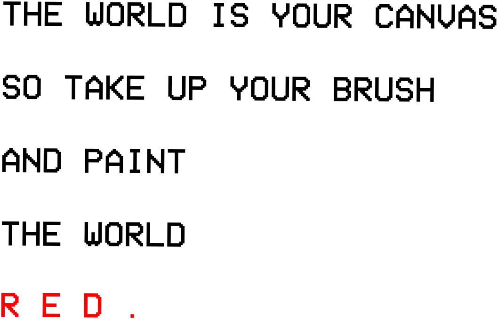

# 💫 About Me:

Hi there! 👋 I'm João Vitor

I'm a Computer Science student at Unochapecó and a Full-stack Developer. Alongside coding, I work as a freelance video editor and love exploring game development.
👨‍💻 About Me

    🎓 Computer Science student (Expected graduation: 2027).

    💻 Full-stack Developer.

    🎮 Passionate about Game Dev and Games in general.

# 💻 Tech Stack:
                           
# 📊 GitHub Stats:

#

